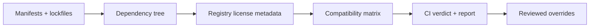
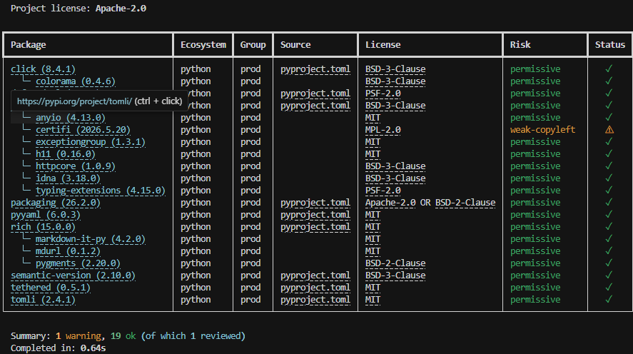

<p align="center">
  
</p>

<h1 align="center">licenseal</h1>

<p align="center">
  A fast, cross-ecosystem license compatibility checker that catches dependency risks before they block releases, audits, or enterprise deals.
</p>

<p align="center">
  Includes a Claude Code review skill for investigating flagged findings and recording documented decisions.
</p>

<p align="center">
  <a href="https://pypi.org/project/licenseal/"></a>
  <a href="https://pypi.org/project/licenseal/"></a>
  <a href="https://github.com/shcherbak-ai/licenseal/blob/main/LICENSE"></a>
  <br>
  <a href="https://github.com/shcherbak-ai/licenseal/actions/workflows/ci.yml"></a>
  <a href="https://github.com/shcherbak-ai/licenseal/actions/workflows/codeql.yml"></a>
  <a href="https://github.com/PyCQA/bandit"></a>
  <br>
  <a href="https://github.com/astral-sh/ruff"></a>
  <a href="https://github.com/astral-sh/uv"></a>
  <a href="https://github.com/astral-sh/ty"></a>
  <a href="https://github.com/shcherbak-ai/tethered"></a>
</p>

**licenseal is a license compatibility checker for dependency trees across language ecosystems.** It tells you whether your dependency licenses are compatible with the license you ship under, using only manifests, lockfiles, and public registry metadata. It does not install dependencies, run package-manager commands, execute build scripts, or download package archives.

```bash
uvx licenseal check
```

> **Not legal advice.** licenseal automates dependency-license discovery and compatibility classification. It is a CI/audit aid, not a substitute for legal review.

## Why This Matters

License problems usually arrive as delivery problems. They show up when a customer, investor, legal reviewer, or procurement team asks what is inside your dependency tree:

| Blocker | What can happen |
| --- | --- |
| Enterprise adoption | Security and procurement teams ask for an open-source license report before approval. |
| Due diligence | Investors, acquirers, or partners flag copyleft, source-available, or unknown-license dependencies late. |
| Release timing | A problematic dependency forces a replacement, upgrade, or architecture change when the team is trying to ship. |
| Hidden transitives | The risky license is several levels down, pulled in by a package that looked harmless. |
| Product obligations | GPL, AGPL, SSPL, BUSL, Elastic, non-commercial Creative Commons, and similar terms may be incompatible with how you distribute or host the product. |
| Audit trail | Review decisions need to be explicit and checked in, not buried in a spreadsheet or chat thread. |

licenseal turns those questions into CI feedback: it scans the dependency tree, explains the compatibility issue, and gives reviewers a documented override path for cases that need human judgment.

Speed matters because license checks only work when they are cheap enough to run on every PR. In benchmark runs, licenseal stayed in seconds-scale territory across real public projects, including large monorepos and dependency graphs reaching thousands of packages, without install or build steps. Results still vary with registry latency, lockfile quality, and cache state.

This is not hypothetical. [Google](https://opensource.google/documentation/reference/thirdparty/licenses) publicly bans AGPL, OSL, SSPL, and several other licenses from key codebases; [Power](https://tech.powerhrg.com/oss-guide/docs/using/agpl.html) treats AGPL as prohibited by default; and [Salesforce](https://engineering.salesforce.com/building-a-secured-data-intelligence-platform-ba85411a0c1b/) and [Uber](https://www.uber.com/us/en/blog/oss-ip/) have written publicly about license review as part of production software governance.

There is legal backdrop too. [*Artifex v. Hancom*](https://artifex.com/blog/artifex-and-hancom-reach-settlement-over-ghostscript-open-source-dispute) settled confidentially in December 2017, so it did not produce a public final judgment; before settlement, the court had [allowed Artifex's GPL contract/damages theory to proceed](https://www.fsf.org/blogs/licensing/update-on-artifex-v-hancom-gnu-gpl-compliance-case-1). In [*Software Freedom Conservancy v. Vizio*](https://sfconservancy.org/copyleft-compliance/vizio.html), Software Freedom Conservancy is pursuing GPL source-code rights as a purchaser of GPL-covered devices; SFC currently lists the case as ongoing with an August 10-19, 2026 trial date.

## How It Works



## Quick Start

Install-free one-shot:

```bash
uvx licenseal check
```

Persistent install:

```bash
uv tool install licenseal
# or
pipx install licenseal
```

Inside a Python project:

```bash
uv add --dev licenseal
# or
pip install licenseal
```

Example output:



The exit code is non-zero when there are unreviewed violations, warnings, unknown licenses, or analysis gaps. See [USAGE.md](USAGE.md) for every flag and report format.

## What It Does

|  |  |  |
| --- | --- | --- |
| **Compatibility verdict**<br>Checks dependencies against your project license. | **Transitive by default**<br>Finds risks several levels down. | **Install-free**<br>Reads manifests, lockfiles, and registries only. |
| **Agent-assisted review**<br>Claude Code skill investigates flagged findings and asks verdict-aware questions. | **Cross-ecosystem**<br>One scan for polyglot repos. | **CI-ready speed**<br>Seconds-scale scans in benchmark runs, with strict exits and JSON/Markdown output. |

## Important Defaults

| Default | Meaning |
| --- | --- |
| `--transitive` | Scans the full dependency tree by default. Use `--no-transitive` for direct deps only. |
| `--no-dev` | Dev dependencies are excluded unless `--dev` is set. |
| `--strict` | Warnings, unknowns, and analysis gaps fail CI in addition to violations. |
| Violations always fail | `--no-strict` demotes warnings, unknowns, and gaps only; definite incompatibilities still fail. |
| Missing project license -> `Proprietary` | If no project license is detected, licenseal treats the project as proprietary/permissive for compatibility checks. |
| Registry-only resolution | No installs, builds, package archive downloads, or source-prose license extraction. |

## Scope

licenseal is intentionally narrow:

- It is a **license compatibility checker**, not a legal approval workflow or policy-exception manager.
- It checks **published dependency license metadata**, not vulnerability status, provenance, or SBOM completeness.
- It reads **manifests, lockfiles, and public registry APIs** only. It does not honor private registry declarations from scanned manifests, because that would expand the network trust boundary.
- It does not infer dependency licenses by pattern-matching local `LICENSE` files or source comments. Free-form license text is easy to misread, spoof, or partially match; missing structured metadata is reported as `UNKNOWN` and routed to manual review instead.
- It does not produce CycloneDX or SPDX SBOMs; use a dedicated SBOM tool when you need that artifact.
- Manual review can override flagged findings when a maintainer has better information, but the review file is an audit record, not hidden legal sign-off.

The full trust boundary and network allowlist are documented in [SECURITY.md](SECURITY.md).

## Supported Ecosystems

Python · JavaScript/TypeScript · Rust · Go · Java/JVM · .NET · PHP · Ruby · Elixir/Erlang · R

Supported registries include PyPI, npm, crates.io, deps.dev, proxy.golang.org, Maven Central, NuGet.org, Packagist, RubyGems, Hex, and CRAN. See [USAGE.md](USAGE.md#supported-ecosystems) for manifest and lockfile details.

## CI Integration

GitHub Actions:

```yaml
# .github/workflows/licenseal.yml
name: License compatibility
on: [push, pull_request]
jobs:
  licenseal:
    runs-on: ubuntu-latest
    steps:
      - uses: actions/checkout@v4
      - uses: astral-sh/setup-uv@v6
      - run: uvx licenseal check
```

README badge:

```md
[](https://github.com/OWNER/REPO/actions/workflows/licenseal.yml)
```

Preview:


Use the workflow status badge as the primary signal: it shows that license compatibility is checked in CI and that the latest run passed.

For a PR comment or audit artifact, write Markdown or JSON. The file is saved before the gate runs, so CI can publish it even on a failing check:

```bash
licenseal check -f markdown -o LICENSES.md   # PR-comment-friendly audit
licenseal check -f json -o report.json       # stable machine-readable schema
```

For projects that want a checked-in audit trail, commit the generated Markdown report as `LICENSES.md`. This repository follows that convention in [LICENSES.md](LICENSES.md).

The JSON schema is documented in [JSON_OUTPUT.md](JSON_OUTPUT.md).

## Manual Review Overrides

When a dependency is flagged but you have better license information than the resolver, record the reviewed license in a checked-in `licenseal.review.toml`:

```toml
[[review]]
ecosystem = "python"
package = "mystery-lib"
version = "1.0.0"
license = "MIT"
note = "reviewed packaged LICENSE file"
```

Workflow:

```bash
licenseal check -f json -o report.json                       # 1. capture flagged deps
licenseal init-review-file --from-report report.json         # 2. scaffold blank entries offline
# 3. fill in `license` and optional `note` for each entry
licenseal check                                              # 4. overrides apply
```

Reviews can only override flagged dependencies, never compatible ones. A reviewed dependency passes strict mode while staying visible in its warning, violation, or unknown bucket with both the detected and reviewed licenses shown.

licenseal also ships a [Claude Code](https://claude.com/claude-code) skill (`licenseal install-skill`, then `/licenseal-review`) that walks through unknowns, warnings, and violations interactively. It can inspect package links, license links, and project context, then ask the questions that matter for how your software is distributed, hosted, or modified. Full review rules are in [USAGE.md](USAGE.md#manual-review-file).

## How Licenseal Decides

licenseal classifies each dependency license into a risk level and compares that risk against the detected project license.

| Project \ Dependency | Permissive | Weak Copyleft | Strong Copyleft | Network Copyleft |
| --- | --- | --- | --- | --- |
| **Permissive** | OK | Warning | Violation | Violation |
| **Weak Copyleft** | OK | OK | Violation | Violation |
| **Strong Copyleft** | OK | OK | OK | Warning |
| **Network Copyleft** | OK | OK | OK | OK |

When `--dev` is set, copyleft violations on dev dependencies downgrade to warnings, since dev deps usually do not ship with the project.

| Risk level | Examples | Meaning |
| --- | --- | --- |
| Permissive | MIT, BSD, Apache-2.0, ISC | No significant restrictions |
| Weak Copyleft | LGPL, MPL-2.0, EPL, CDDL | File-scope reciprocity; linking from other files is usually allowed |
| Strong Copyleft | GPL, OSL, EUPL, CC-BY-SA | Share-alike obligations can extend to the derivative work |
| Network Copyleft | AGPL-3.0-only | Strong copyleft with network-use source-offer obligations |
| Unknown | SSPL, BUSL, Elastic, CC-BY-NC; missing or unrecognized licenses | Cannot be auto-classified; routed to manual review |

A dependency is **Unknown** when the registry returns no license, a non-SPDX string, or a source-available / use-restricted license (`SSPL`, `BUSL`, `Elastic`, `FSL`, `Parity`, `PolyForm`, `CC-BY-NC*` / `CC-BY-ND*`) whose custom terms are not auto-evaluated. The full matrix rationale is in [USAGE.md](USAGE.md).

## How It Compares

Comparison last reviewed: June 2026. Tool capabilities change; check each project before making a buying or compliance decision.

|  | licenseal | [pip-licenses](https://github.com/raimon49/pip-licenses) | [license-checker](https://github.com/davglass/license-checker) | [LicenseFinder](https://github.com/pivotal/LicenseFinder) | [fossa-cli](https://github.com/fossas/fossa-cli) |
| --- | :-: | :-: | :-: | :-: | :-: |
| Multiple ecosystems in one tool | ✓ (10) | - | - | ✓ | ✓ |
| Broad transitive source-tree discovery | ✓ | ~ | ~ | ~ | ~ |
| Project-license compatibility verdict | ✓ | - | - | ~ | ✓ |
| No install / no code execution | ✓ | - | - | - | ~ |
| Fast, seconds-scale CI path | ✓ | ~ | ~ | - | - |
| Manual review override file | ✓ | - | - | ✓ | ~ |
| Agent-assisted flagged-finding review | ✓ | - | - | - | - |
| Local-only, no hosted service | ✓ | ✓ | ✓ | ✓ | - |
| Offline operation | - | ✓ | ✓ | ~ | - |
| SBOM output (CycloneDX / SPDX) | - | - | - | - | ✓ |

`✓` supported · `~` partial · `-` not supported

No tool clears every row. The discovery row is about source-tree analysis: manifests, lockfiles, and registry metadata before a successful package-manager install is assumed. Some tools can produce broader inventories after installation or hosted analysis; licenseal is optimized for broad transitive coverage in CI without that prerequisite. Pair it with an SBOM generator, hosted compliance platform, or installed-metadata scanner when those are the artifacts or workflows you need.

## Learn More

- **[USAGE.md](USAGE.md)** - full CLI reference, transitive-resolution behavior, per-ecosystem detail, review-file rules, and the Claude Code skill
- **[SECURITY.md](SECURITY.md)** - the manifest-and-registry trust boundary and exact network-egress allowlist
- **[JSON_OUTPUT.md](JSON_OUTPUT.md)** - stable machine-readable schema

## Contributing

See [CONTRIBUTING.md](CONTRIBUTING.md) for development setup and guidelines.

If licenseal helps your project, star ⭐ this repo to help other teams find it too.

## License

[Apache-2.0](LICENSE). See [`LICENSE`](LICENSE) for the full text and [`NOTICE`](NOTICE) for attribution.
